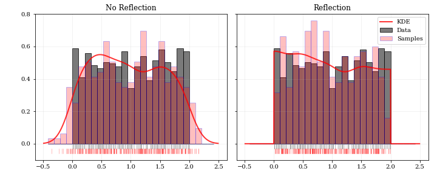
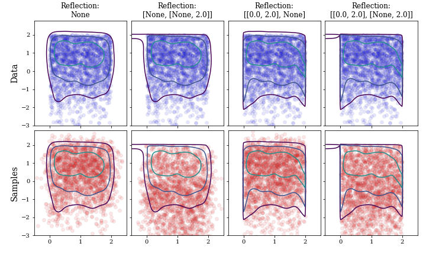
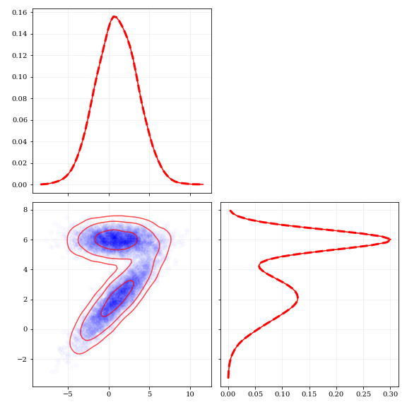

# KDES: Kernel Density Estimation and Sampling

[](https://travis-ci.org/lzkelley/kdes)
[](https://codecov.io/gh/lzkelley/kdes)

dev: [](https://travis-ci.org/lzkelley/kdes)

This package performs KDE operations on multidimensional data to: **1) calculate estimated PDFs** (probability distribution functions), and **2) to resample new data** from those PDFs.

## Installation

#### from source

```bash
git clone https://github.com/lzkelley/kdes.git
pip install -e kdes/
```


## Examples

### Use 'reflecting' boundary conditions to improve PDF reconstruction at boundaries

Without reflection, the KDE (red line) noticeably underestimates the edges of this uniform distribution (grey histogram).  When resampling from the KDE, the new samples (red carpet and histogram) are drawn outside of the original distribution edges.  Reflecting boundary conditions better estimate the PDF, and constrain new samples to be within bounds.

```python
import kdes
# here `data` has shape (N,) for N data points
kde = kdes.KDE(data)
grid = np.linspace(-0.5, 2.5, 1000)
# choose reflection boundaries
boundaries = [0.0, 2.0]
pdf = kde.pdf(grid, reflect=boundaries)
samples = kde.resample(100, reflect=boundaries)
```



This also works in multiple dimensions.  In each dimension, reflecting boundaries can be applied either on both sides (e.g. x-axis), or only on one side (e.g. y-axis).

```python
import kdes
# here `data` has shape (2,N) 2-parameters and N data points
kde = kdes.KDE(data)
xc, yc = np.meshgrid([np.linspace(-0.5, 2.5, 100), np.linspace(-3.0, 2.5, 200)])
grid = np.vstack([xc.ravel(), yc.ravel()])
# choose reflection boundaries in each parameter
boundaries = [[0.0, 2.0], [None, 2.0]]
pdf = kde.pdf(grid, reflect=boundaries)
samples = kde.resample(1000, reflect=boundaries)
```




### Calculate projected / marginalized PDF across target parameters

```python

# 2-parameter data, shaped (2,N) for N data-points
kde = kdes.KDE(data)

# Create bins in each dimension
edges = [np.linspace(-7.5, 10.5, 100), np.linspace(-3, 9, 100)]
xe, ye = np.meshgrid(*edges)
# Grid of test points
grid = np.vstack([xe.ravel(), ye.ravel()])

# Calculate 2D PDF
pdf_2d = kde.pdf(grid)
# Calculate each 1D PDF
pdf_x = kde.pdf(edges[0], param=0)
pdf_y = kde.pdf(edges[1], param=1)
```


